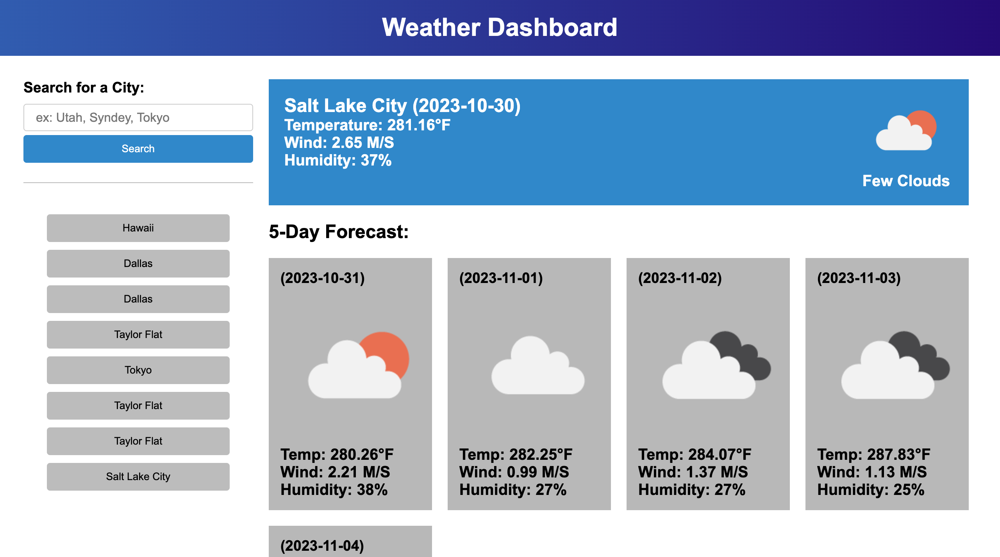

<!-- Improved compatibility of back to top link: See: https://github.com/othneildrew/Best-README-Template/pull/73 -->

[![Contributors][contributors-shield]][contributors-url]
[![Forks][forks-shield]][forks-url]
[![Stargazers][stars-shield]][stars-url]
[![Issues][issues-shield]][issues-url]

<h3 align="center">OpenWeather</h3>

  

    This project is a simple Work Day Scheduler web application that allows users to plan and organize their workday by entering tasks or events into time-blocks corresponding to different hours of the day. 
     
    <a href="https://github.com/JackieChheng/WeatherMap"><strong>Explore the docs »</strong></a>
     
     
    <a href="https://github.com/JackieChheng/WeatherMap">View Demo</a>
    ·
    <a href="https://github.com/JackieChheng/WeatherMap/issues">Report Bug</a>
    ·
    <a href="https://github.com/JackieChheng/WeatherMap/issues">Request Feature</a>
  

<!-- TABLE OF CONTENTS -->

  
Table of Contents

  <ol>
    <li>
      <a href="#about-the-project">About The Project</a>
      <ul>
      </ul>
    </li>
    <li>
      <a href="#getting-started">Getting Started</a>
      <ul>
      </ul>
    </li>
    <li><a href="#usage">Usage</a></li>
    <li><a href="#roadmap">Roadmap</a></li>
    <li><a href="#contributing">Contributing</a></li>
    <li><a href="#license">License</a></li>
    <li><a href="#contact">Contact</a></li>
  </ol>

<!-- ABOUT THE PROJECT -->
## About The Project

This weather website provides users with a clean and responsive interface to search for current weather and a 5-day weather forecast for any city. 

(<a href="#readme-top">back to top</a>)

<!-- GETTING STARTED -->
## Getting Started

Just visit the page and search any city that you would like to see the weather of today, and the future 5 days.

(<a href="#readme-top">back to top</a>)

<!-- USAGE EXAMPLES -->
## Usage

This weather website serves as a user-friendly tool for checking the current weather and 5-day forecasts for various cities.

(<a href="#readme-top">back to top</a>)

<!-- ROADMAP -->
## Roadmap

- [x] APIs
- [x] LocalStorage
- [x] 5 Day Forecast
    - [ ] More times 

See the [open issues](https://github.com/JackieChheng/WeatherMap/issues) for a full list of proposed features (and known issues).

(<a href="#readme-top">back to top</a>)

<!-- CONTRIBUTING -->
## Contributing

Contributions are what make the open source community such an amazing place to learn, inspire, and create. Any contributions you make are **greatly appreciated**.

If you have a suggestion that would make this better, please fork the repo and create a pull request. You can also simply open an issue with the tag "enhancement".
Don't forget to give the project a star! Thanks again!

1. Fork the Project
2. Create your Feature Branch (`git checkout -b feature/AmazingFeature`)
3. Commit your Changes (`git commit -m 'Add some AmazingFeature'`)
4. Push to the Branch (`git push origin feature/AmazingFeature`)
5. Open a Pull Request

(<a href="#readme-top">back to top</a>)

<!-- LICENSE -->
## License

Distributed under the N/A License. See `LICENSE.txt` for more information.

(<a href="#readme-top">back to top</a>)

<!-- CONTACT -->
## Contact

Jackie Chheng - fake@gmail.com

Project Link: [https://github.com/JackieChheng/WeatherMap](https://github.com/JackieChheng/WeatherMap)

(<a href="#readme-top">back to top</a>)

<!-- MARKDOWN LINKS & IMAGES -->
<!-- https://www.markdownguide.org/basic-syntax/#reference-style-links -->
[contributors-shield]: https://img.shields.io/github/contributors/JackieChheng/WorkDayScheduler.svg?style=for-the-badge
[contributors-url]: https://github.com/JackieChheng/WeatherMap/graphs/contributors
[forks-shield]: https://img.shields.io/github/forks/JackieChheng/WorkDayScheduler.svg?style=for-the-badge
[forks-url]: https://github.com/JackieChheng/WeatherMap/network/members
[stars-shield]: https://img.shields.io/github/stars/JackieChheng/WorkDayScheduler.svg?style=for-the-badge
[stars-url]: https://github.com/JackieChheng/WeatherMap/stargazers
[issues-shield]: https://img.shields.io/github/issues/JackieChheng/WorkDayScheduler.svg?style=for-the-badge
[issues-url]: https://github.com/JackieChheng/WeatherMap/issues
[license-shield]: https://img.shields.io/github/license/JackieChheng/WorkDayScheduler.svg?style=for-the-badge
[license-url]: https://github.com/JackieChheng/WeatherMap/blob/master/LICENSE.txt
[linkedin-shield]: https://img.shields.io/badge/-LinkedIn-black.svg?style=for-the-badge&logo=linkedin&colorB=555
